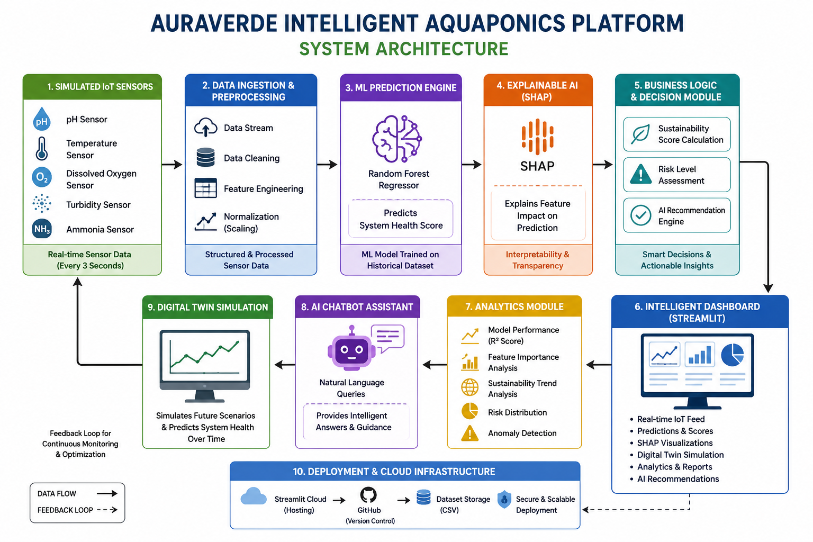
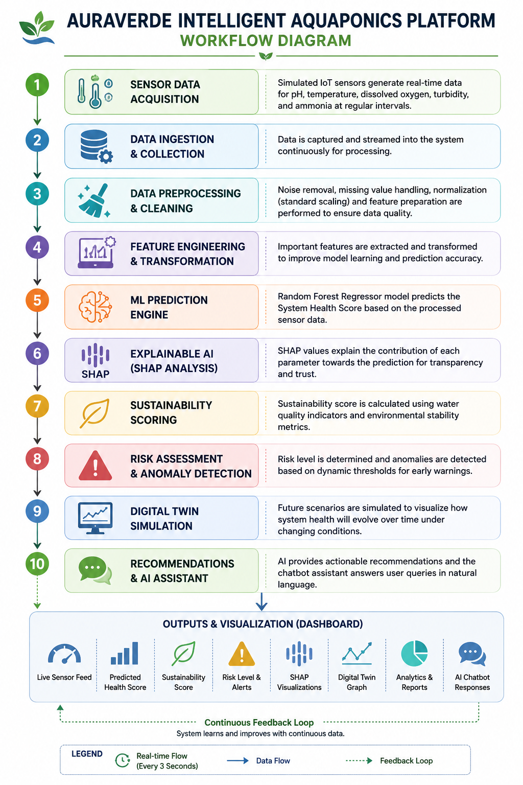

🌱 AURAVERDE Intelligent Aquaponics Platform

📌 Project Overview

AURAVERDE is an AI-powered intelligent aquaponics monitoring and sustainability analytics platform that integrates Machine Learning, Explainable AI, Digital Twin Simulation, and Real-Time IoT telemetry for smart environmental monitoring and predictive decision-making. The platform continuously analyzes critical water quality parameters such as pH, dissolved oxygen, temperature, turbidity, and ammonia to predict system health, assess sustainability, detect anomalies, and generate AI-driven recommendations.

❗ Problem Statement

Traditional aquaponics systems lack intelligent monitoring, predictive analytics, and automated sustainability assessment capabilities. Manual monitoring often leads to delayed detection of water quality issues, affecting fish health, crop productivity, and environmental stability. This project aims to address these challenges using Artificial Intelligence, Machine Learning, and simulated IoT-based real-time monitoring.

✅ Proposed Solution

The proposed system integrates:

Real-Time IoT Sensor Simulation

Machine Learning-Based Health Prediction

SHAP Explainable AI

Digital Twin Simulation

Sustainability Scoring

AI Recommendation Engine

Risk & Anomaly Detection

Interactive Streamlit Dashboard

🚀 Key Features

📡 Real-Time IoT Sensor Simulation

🤖 AI-Based System Health Prediction

🔍 Explainable AI using SHAP

🌍 Sustainability Scoring System

📈 Digital Twin Simulation

⚠️ Risk Assessment & Anomaly Detection

📊 Interactive Analytics Dashboard

💡 AI Recommendation Engine

💬 AI Chatbot Assistant

☁️ Cloud Deployment using Streamlit

AI Chatbot Assistant

 🏗️ System Architecture

 🔄 Workflow Diagram

 🛠️ Technology Stack

| Category | Technologies |
|---|---|
| Programming Language | Python |
| Dashboard | Streamlit |
| Machine Learning | Scikit-learn |
| Explainable AI | SHAP |
| Data Processing | Pandas, NumPy |
| Visualization | Matplotlib |
| Deployment | Streamlit Cloud |
| Version Control | GitHub |

 🧠 Machine Learning Components

 ✔ Random Forest Regressor
Used for predicting overall aquaponics system health.

 ✔ SHAP Explainability
Used to interpret the contribution of environmental parameters toward model predictions.

 ✔ Digital Twin Simulation
Simulates future system behavior and environmental dynamics.

 ✔ Anomaly Detection
Detects abnormal conditions such as ammonia spikes or oxygen depletion.

 ✔ AI Recommendation Engine
Provides actionable recommendations based on real-time environmental conditions to create a smart decision-support platform for sustainable aquaponics management.

 📊 Dashboard Features

- Real-Time Sensor Feed
- Interactive Digital Twin Graph
- SHAP Explainability Visualization
- Sustainability Trend Analysis
- Feature Importance Analysis
- Risk Distribution Analytics
- AI Chatbot Assistant
- Automated AI Recommendations

## ☁️ Live Deployment

Streamlit Dashboard Link:
[Click Here](https://auraverde-ai-dashboard-dbrhsrj6dbgcuzmeuyc36a.streamlit.app/)

 🔮 Future Scope

- Integration with real IoT hardware sensors
- Firebase/MQTT-based real-time cloud telemetry
- Mobile application development
- Advanced Deep Learning models
- AI-powered automated control systems
- Blockchain-enabled sustainability tracking

 ▶️ How to Run Locally

 Clone Repository

git clone (https://auraverde-ai-dashboard-dbrhsrj6dbgcuzmeuyc36a.streamlit.app/)
pip install -r requirements.txt
streamlit run app.py

👨‍💻 Authors

Developed by:
- Ritam Das

